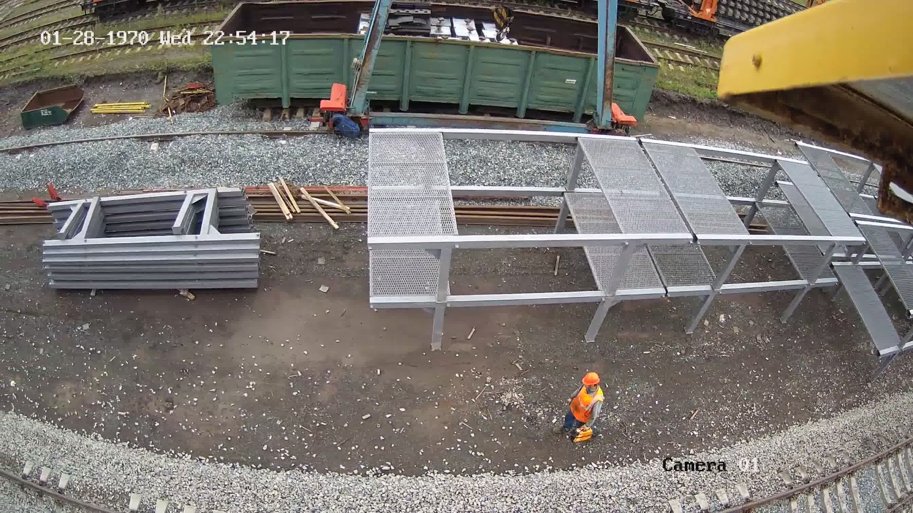

# 🚂 Railway Track Object Detection Using YOLO

A comprehensive web application for automated detection and analysis of objects and features on railway tracks using state-of-the-art YOLO deep learning technology.

## 📋 Table of Contents

- [Overview](#overview)
- [Features](#features)
- [Project Structure](#project-structure)
- [Installation](#installation)
- [Usage](#usage)
- [Model Information](#model-information)
- [Gallery](#gallery)
- [Customization](#customization)
- [Contributing](#contributing)
- [License](#license)
- [Acknowledgements](#acknowledgements)

## 🔍 Overview

This project leverages the power of YOLO (You Only Look Once) object detection to identify and annotate various objects and features on railway tracks. Built with Flask, it provides an intuitive web interface for uploading railway images and receiving real-time detection results with visual annotations.

### Key Technologies
- **Deep Learning**: Ultralytics YOLO
- **Backend**: Flask (Python)
- **Frontend**: HTML/CSS with Jinja2 templating
- **Computer Vision**: OpenCV, PIL

## ✨ Features

- 🖼️ **User-Friendly Interface**: Clean, responsive web UI for seamless interaction
- 🎯 **Real-Time Detection**: Instant object detection and annotation on uploaded images
- 📊 **Comprehensive Analysis**: Detects multiple railway track objects and features
- 📁 **Organized Storage**: Automatic management of uploads and results
- 🔄 **Batch Processing**: Support for multiple image uploads
- 📱 **Cross-Platform**: Works on desktop and mobile browsers

## 📂 Project Structure

```
railway-track-detection/
│
├── 📄 app.py                     # Main Flask application
├── 🤖 best.pt                    # Trained YOLO model weights
├── 📋 requirements.txt           # Python dependencies
├── 📖 README.md                  # Project documentation
│
├── 📁 static/
│   ├── 📁 uploads/               # User uploaded images
│   └── 📁 results/               # Detection results with annotations
│
└── 📁 templates/
    ├── 🏠 home.html              # Landing page
    ├── 📤 prediction_page.html    # Image upload interface
    └── 📊 prediction_result_page_.html  # Results display
```

## 🚀 Installation

### Prerequisites
- Python 3.8 or higher
- pip package manager

### Setup Steps

1. **Clone the Repository**
   ```bash
   git clone https://github.com/your-username/railway-track-detection.git
   cd railway-track-detection
   ```

2. **Create Virtual Environment** (Recommended)
   ```bash
   python -m venv venv
   source venv/bin/activate  # On Windows: venv\Scripts\activate
   ```

3. **Install Dependencies**
   ```bash
   pip install -r requirements.txt
   ```

4. **Verify Model File**
   - Ensure `best.pt` (YOLO weights) is in the project root
   - If missing, place your trained model file here

5. **Create Required Directories**
   ```bash
   mkdir -p static/uploads static/results
   ```

6. **Launch Application**
   ```bash
   python app.py
   ```

7. **Access the Application**
   - Open your browser and navigate to `http://127.0.0.1:5000/`

## 🎮 Usage

### Step-by-Step Guide

1. **Home Page**: Visit the landing page for project overview
2. **Upload Image**: Navigate to the prediction page and select a railway track image
3. **Process**: Click submit to run YOLO detection
4. **View Results**: Examine the annotated image with detected objects highlighted
5. **History**: Access previously processed images from the results directory

### Supported Image Formats
- JPEG/JPG
- PNG
- BMP
- TIFF

## 🤖 Model Information

- **Architecture**: YOLOv8/YOLOv5 (Ultralytics)
- **Training Data**: Custom railway track dataset
- **Model File**: `best.pt` (PyTorch format)
- **Input Size**: Automatically resized for optimal performance
- **Output**: Bounding boxes with confidence scores and class labels

### Detectable Objects
- Railway tracks and rails
- Trains and locomotives
- Railway infrastructure
- Track maintenance equipment
- Personnel on tracks
- Safety equipment

## 🖼️ Gallery

### Sample Detection Results

**Railway Track Analysis**


**Construction Site Monitoring**


**Infrastructure Installation**


**Safety Inspection**


<details>
<summary>View More Examples</summary>

**Construction Activity**


**Monitoring Operations**


**Engineering Inspection**


**Field Operations**


</details>

## ⚙️ Customization

### Using Your Own Model
1. Replace `best.pt` with your trained YOLO weights
2. Ensure the model is compatible with Ultralytics YOLO format
3. Update class names in `app.py` if different from the current model

### UI Customization
- Modify HTML templates in `templates/` directory
- Add custom CSS styles for enhanced appearance
- Update Flask routes in `app.py` for additional functionality

### Advanced Configuration
```python
# Example model configuration in app.py
model = YOLO('best.pt')
model.conf = 0.5  # Confidence threshold
model.iou = 0.45  # IoU threshold
```

## 🤝 Contributing

We welcome contributions! Please follow these steps:

1. Fork the repository
2. Create a feature branch (`git checkout -b feature/amazing-feature`)
3. Commit your changes (`git commit -m 'Add amazing feature'`)
4. Push to the branch (`git push origin feature/amazing-feature`)
5. Open a Pull Request

### Development Guidelines
- Follow PEP 8 style guide for Python code
- Add comments for complex logic
- Update documentation for new features
- Test thoroughly before submitting

## 📄 License

This project is licensed under the MIT License. See the [LICENSE](LICENSE) file for details.

## 🙏 Acknowledgements

- [Ultralytics YOLO](https://ultralytics.com/) - For the excellent YOLO implementation
- [Flask](https://flask.palletsprojects.com/) - For the web framework
- [OpenCV](https://opencv.org/) - For computer vision utilities
- Railway industry professionals who provided domain expertise
- Open source community contributors

---

## 📞 Support

If you encounter any issues or have questions:

1. Check the [Issues](https://github.com/your-username/railway-track-detection/issues) page
2. Create a new issue with detailed information
3. Contact the development team

**Made with ❤️ for railway safety and automation**


output:

